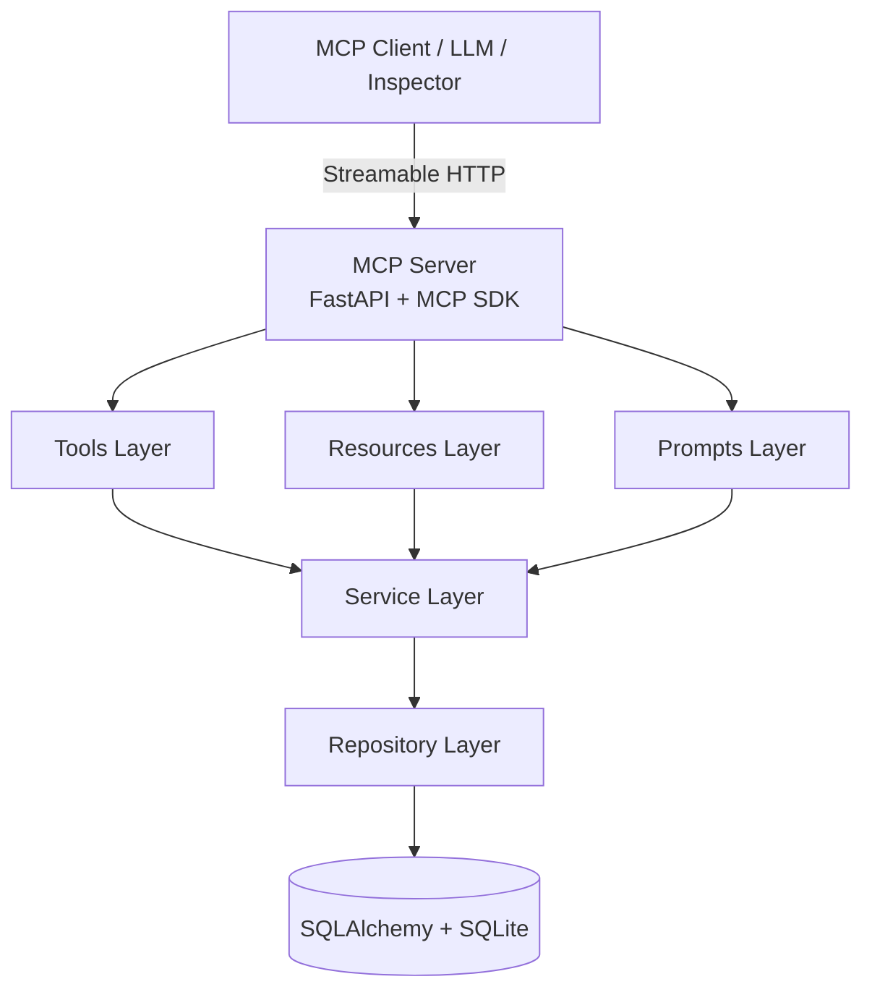
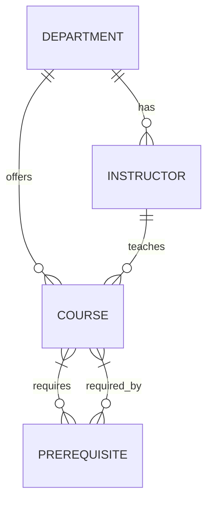

# University Course Catalog MCP Server

[](https://www.python.org/downloads/)
[](https://modelcontextprotocol.io/)
[](https://fastapi.tiangolo.com/)
[](https://www.sqlalchemy.org/)
[](https://www.docker.com/)
[](https://pytest.org/)
[](LICENSE)

A production-grade **Model Context Protocol (MCP) server** that exposes a university course catalog through standardized tools, resources, and prompts. Enables AI assistants and LLM-based applications to search courses, retrieve prerequisites, look up instructors, visualize dependency graphs, and access structured catalog data.

---

## Table of Contents

- [Overview](#overview)
- [Architecture](#architecture)
- [Features](#features)
- [Tech Stack](#tech-stack)
- [Project Structure](#project-structure)
- [Quick Start](#quick-start)
- [Docker Deployment](#docker-deployment)
- [API Reference](#api-reference)
- [MCP Protocol](#mcp-protocol)
- [Data Model](#data-model)
- [Seeded Data](#seeded-data)
- [Testing](#testing)
- [Development](#development)
- [Troubleshooting](#troubleshooting)
- [Contributing](#contributing)
- [License](#license)

---

## Overview

The **University Course Catalog MCP Server** implements the [Model Context Protocol](https://modelcontextprotocol.io/) (MCP) to provide structured access to a university course catalog. Unlike traditional REST APIs, MCP enables AI agents to discover and invoke capabilities dynamically through a standardized protocol.

### What is MCP?

The Model Context Protocol is an open standard that allows AI applications to securely connect to external data sources and tools. It defines:

- **Tools** - Functions the AI can invoke (e.g., search courses, get prerequisites)
- **Resources** - Read-only data sources (e.g., course descriptions, department directory)
- **Prompts** - Reusable prompt templates (e.g., course comparison, academic advising)

### Why This Project?

| Traditional API | MCP Server |
|----------------|------------|
| Fixed endpoints | Dynamic capability discovery |
| Manual integration | Standardized protocol |
| Single consumer | Multiple AI clients |
| Custom schemas | Shared type definitions |

---

## Architecture



### Layer Responsibilities

| Layer | Purpose | Files |
|-------|---------|-------|
| **MCP Layer** | Protocol handling, tool/resource/prompt registration | `src/university_catalog/mcp/` |
| **Service Layer** | Business logic, data transformation | `src/university_catalog/services/` |
| **Repository Layer** | Data access, query abstraction | `src/university_catalog/repositories/` |
| **Data Layer** | SQLAlchemy models, database config | `src/university_catalog/models.py`, `database.py` |
| **API Layer** | Health check, root endpoint | `src/university_catalog/api/` |

---

## Features

### Tools (4)

| Tool | Description | Input | Output |
|------|-------------|-------|--------|
| `search_courses` | Full-text search across course codes, titles, descriptions with optional department filter | `query: string`, `department_code?: string` | `CourseResult[]` |
| `get_prerequisites` | Direct (non-transitive) prerequisites for a course | `course_code: string` | `PrerequisitesResult` |
| `lookup_instructor` | Case-insensitive instructor search with contact info | `instructor_name: string` | `InstructorResult` / `ErrorResponse` |
| `get_prerequisite_graph` | Complete transitive prerequisite dependency graph | `course_code: string` | `PrerequisiteGraphResult` |

### Resources (2)

| Resource | URI | Description |
|----------|-----|-------------|
| Course Descriptions | `resource://course_descriptions` | All courses with code, title, full description |
| Department Directory | `resource://department_directory` | All departments with names and codes |

### Prompts (2)

| Prompt | Description | Arguments |
|--------|-------------|-----------|
| `course_comparison_template` | Structured side-by-side course comparison | `course_code_1`, `course_code_2` |
| `course_advisor` | Academic advising for course planning | `student_goals`, `completed_courses` |

---

## Tech Stack

| Category | Technology | Version |
|----------|------------|---------|
| **Language** | Python | 3.12+ |
| **Protocol** | MCP Python SDK | 1.6+ |
| **Web Framework** | FastAPI | 0.115+ |
| **ASGI Server** | Uvicorn | 0.32+ |
| **ORM** | SQLAlchemy | 2.0+ |
| **Database** | SQLite | 3.x |
| **Validation** | Pydantic | 2.9+ |
| **Graph Algorithms** | NetworkX | 3.4+ |
| **Testing** | pytest + pytest-asyncio | 8.3+ |
| **Containerization** | Docker + Docker Compose | Latest |

---

## Project Structure

```
university-course-catalog-mcp/
├── .dockerignore              # Docker build exclusions
├── .env.example               # Environment variable template
├── .gitignore                 # Git exclusions
├── Dockerfile                 # Multi-stage production Dockerfile
├── docker-compose.yml         # Service orchestration
├── pyproject.toml             # Package metadata & dependencies
├── requirements.txt           # Pip dependencies
├── pytest.ini                 # Test configuration
├── README.md                  # This file
├── LICENSE                    # MIT License
│
├── data/
│   ├── catalog.db             # SQLite database (auto-seeded)
│   └── seed.py                # Database seeding script
│
├── src/
│   └── university_catalog/
│       ├── __init__.py
│       ├── main.py            # FastAPI app + MCP integration
│       ├── config.py          # Pydantic settings management
│       ├── database.py        # SQLAlchemy engine/session factory
│       ├── models.py          # SQLAlchemy ORM models
│       ├── schemas.py         # Pydantic schemas (MCP contracts)
│       │
│       ├── repositories/      # Data access layer
│       │   ├── __init__.py
│       │   └── course_repository.py
│       │
│       ├── services/          # Business logic layer
│       │   ├── __init__.py
│       │   ├── course_service.py
│       │   └── instructor_service.py
│       │
│       ├── mcp/               # MCP server components
│       │   ├── __init__.py
│       │   ├── server.py      # FastMCP server factory
│       │   ├── tools.py       # 4 MCP tool implementations
│       │   ├── resources.py   # 2 MCP resource implementations
│       │   └── prompts.py     # 2 MCP prompt implementations
│       │
│       └── api/               # REST endpoints
│           ├── __init__.py
│           └── health.py      # Health check endpoint
│
└── tests/                     # Comprehensive test suite (57 tests)
    ├── __init__.py
    ├── test_database.py       # Schema, constraints, data integrity
    ├── test_health.py         # HTTP endpoint tests
    ├── test_mcp_integration.py # End-to-end MCP protocol tests
    ├── test_prompts.py        # Prompt template tests
    ├── test_resources.py      # Resource content tests
    └── test_tools.py          # Tool behavior tests
```

---

## Quick Start

### Prerequisites

- Python 3.12+
- Git

### Local Development

```bash
# 1. Clone the repository
git clone https://github.com/yourusername/university-course-catalog-mcp.git
cd university-course-catalog-mcp

# 2. Create virtual environment
python -m venv .venv
source .venv/bin/activate  # Linux/macOS
# .venv\Scripts\activate   # Windows

# 3. Install dependencies
pip install -r requirements.txt

# 4. Configure environment
cp .env.example .env
# Edit .env if needed (defaults work out of the box)

# 5. Run the server
python -m uvicorn university_catalog.main:app --host 0.0.0.0 --port 8080 --reload
```

Server starts at:
- **MCP Endpoint**: `http://localhost:8080/mcp`
- **Health Check**: `http://localhost:8080/health`
- **Root Info**: `http://localhost:8080/`

---

## Docker Deployment

### Production Build

```bash
# Build and start (detached)
docker compose up --build -d

# Check status
docker compose ps

# View logs
docker compose logs -f mcp-server

# Stop
docker compose down
```

### Clean Rebuild (No Cache)

```bash
docker compose down -v
docker compose build --no-cache
docker compose up -d
```

### Verify Health

```bash
curl http://localhost:8080/health
# Expected: {"status":"healthy","database":"connected"}
```

### Configuration

| Variable | Default | Description |
|----------|---------|-------------|
| `DATABASE_URL` | `sqlite:///./data/catalog.db` | SQLite database path |
| `HOST` | `0.0.0.0` | Bind address |
| `PORT` | `8080` | Server port |
| `LOG_LEVEL` | `INFO` | Logging verbosity |

Override via `.env` or `docker-compose.yml` environment section.

---

## API Reference

### Health Check

```http
GET /health
```

**Response (200 OK)**
```json
{
  "status": "healthy",
  "database": "connected"
}
```

### Root Information

```http
GET /
```

**Response (200 OK)**
```json
{
  "name": "University Course Catalog MCP Server",
  "version": "1.0.0",
  "mcp_endpoint": "/mcp",
  "health_endpoint": "/health"
}
```

### MCP Endpoint

```http
GET /mcp
```

Streamable HTTP transport for MCP protocol. Compatible with:
- [MCP Inspector](https://github.com/modelcontextprotocol/inspector)
- Any MCP-compatible client (Claude Desktop, custom agents, etc.)

---

## MCP Protocol

### Transport

This server uses **Streamable HTTP** transport (MCP specification). The endpoint is:

```
http://localhost:8080/mcp
```

### Capability Discovery

```typescript
// Tools
await mcp.listTools()
// Returns: search_courses, get_prerequisites, lookup_instructor, get_prerequisite_graph

// Resources
await mcp.listResources()
// Returns: resource://course_descriptions, resource://department_directory

// Prompts
await mcp.listPrompts()
// Returns: course_comparison_template, course_advisor
```

### Tool Invocation Examples

#### Search Courses
```typescript
await mcp.callTool("search_courses", {
  query: "machine learning",
  department_code: "AIML"
})
```
**Returns:**
```json
[
  {"course_code": "AIML201", "title": "Introduction to Artificial Intelligence", "credits": 3},
  {"course_code": "AIML301", "title": "Machine Learning", "credits": 4}
]
```

#### Get Direct Prerequisites
```typescript
await mcp.callTool("get_prerequisites", {
  "course_code": "CS301"
})
```
**Returns:**
```json
{
  "course_code": "CS301",
  "prerequisites": [
    {"course_code": "CS102", "title": "Data Structures"}
  ]
}
```

#### Lookup Instructor
```typescript
await mcp.callTool("lookup_instructor", {
  "instructor_name": "Dr. Alice Smith"
})
```
**Returns:**
```json
{
  "name": "Dr. Alice Smith",
  "email": "alice.smith@university.edu",
  "department_name": "Computer Science"
}
```

#### Get Prerequisite Graph
```typescript
await mcp.callTool("get_prerequisite_graph", {
  "course_code": "CS301"
})
```
**Returns:**
```json
{
  "nodes": [
    {"id": "CS101"},
    {"id": "CS102"},
    {"id": "CS301"}
  ],
  "edges": [
    {"source": "CS101", "target": "CS102"},
    {"source": "CS102", "target": "CS301"}
  ]
}
```

### Resource Reading

```typescript
// Course descriptions
await mcp.readResource("resource://course_descriptions")

// Department directory
await mcp.readResource("resource://department_directory")
```

### Prompt Fetching

```typescript
await mcp.getPrompt("course_comparison_template", {
  "course_code_1": "CS101",
  "course_code_2": "CS102"
})
```

---

## Data Model

### Entity Relationship Diagram



### Tables

#### `departments`
| Column | Type | Constraints |
|--------|------|-------------|
| `id` | INTEGER | PK, Auto-increment |
| `name` | VARCHAR(255) | NOT NULL |
| `code` | VARCHAR(50) | NOT NULL, UNIQUE, INDEX |

#### `instructors`
| Column | Type | Constraints |
|--------|------|-------------|
| `id` | INTEGER | PK, Auto-increment |
| `name` | VARCHAR(255) | NOT NULL |
| `email` | VARCHAR(255) | NOT NULL |
| `office` | VARCHAR(255) | NULLABLE |
| `department_id` | INTEGER | FK → departments.id, NOT NULL, INDEX |

#### `courses`
| Column | Type | Constraints |
|--------|------|-------------|
| `id` | INTEGER | PK, Auto-increment |
| `course_code` | VARCHAR(50) | NOT NULL, UNIQUE, INDEX |
| `title` | VARCHAR(255) | NOT NULL |
| `description` | TEXT | NOT NULL |
| `credits` | INTEGER | NOT NULL |
| `instructor_id` | INTEGER | FK → instructors.id, NOT NULL, INDEX |
| `department_id` | INTEGER | FK → departments.id, NOT NULL, INDEX |

#### `prerequisites`
| Column | Type | Constraints |
|--------|------|-------------|
| `course_id` | INTEGER | PK, FK → courses.id, INDEX |
| `prerequisite_id` | INTEGER | PK, FK → courses.id, INDEX |

---

## Seeded Data

The database auto-seeds on first startup with realistic university data:

### Departments (5)
| Code | Name |
|------|------|
| CS | Computer Science |
| AIML | Artificial Intelligence & Machine Learning |
| DS | Data Science |
| IT | Information Technology |
| MATH | Mathematics |

### Instructors (8)
| Name | Email | Department |
|------|-------|------------|
| Dr. Alice Smith | alice.smith@university.edu | CS |
| Dr. Bob Johnson | bob.johnson@university.edu | CS |
| Dr. Carol Williams | carol.williams@university.edu | AIML |
| Dr. David Brown | david.brown@university.edu | DS |
| Dr. Eva Martinez | eva.martinez@university.edu | IT |
| Dr. Frank Chen | frank.chen@university.edu | MATH |
| Dr. Grace Lee | grace.lee@university.edu | AIML |
| Dr. Henry Davis | henry.davis@university.edu | DS |

### Courses (15)
| Code | Title | Credits | Dept | Instructor |
|------|-------|---------|------|------------|
| CS101 | Introduction to Programming | 3 | CS | Dr. Alice Smith |
| CS102 | Data Structures | 3 | CS | Dr. Alice Smith |
| CS201 | Database Systems | 3 | CS | Dr. Bob Johnson |
| CS202 | Object-Oriented Programming | 3 | CS | Dr. Bob Johnson |
| CS301 | Algorithms | 4 | CS | Dr. Alice Smith |
| CS302 | Operating Systems | 4 | CS | Dr. Bob Johnson |
| AIML201 | Introduction to Artificial Intelligence | 3 | AIML | Dr. Carol Williams |
| AIML301 | Machine Learning | 4 | AIML | Dr. Grace Lee |
| DS201 | Statistics for Data Science | 3 | DS | Dr. David Brown |
| DS301 | Data Mining | 3 | DS | Dr. Henry Davis |
| IT101 | Information Technology Fundamentals | 3 | IT | Dr. Eva Martinez |
| IT201 | Network Administration | 3 | IT | Dr. Eva Martinez |
| MATH101 | Calculus I | 4 | MATH | Dr. Frank Chen |
| MATH201 | Linear Algebra | 3 | MATH | Dr. Frank Chen |
| MATH301 | Discrete Mathematics | 3 | MATH | Dr. Frank Chen |

### Prerequisite Relationships (12)

```text
CS101 → CS102 → CS301
CS101 → CS201
CS101 → CS202 → CS302
CS201 → DS301
DS201 → DS301
AIML201 → AIML301
CS201 → AIML301
IT101 → IT201
MATH101 → MATH201
MATH101 → MATH301
```

> **Note**: Arrows indicate "is prerequisite for" (source → target)

---

## Testing

### Run All Tests

```bash
# Quick run
pytest -q

# Verbose with coverage
pytest -v --cov=university_catalog --cov-report=term-missing

# Specific test modules
pytest tests/test_tools.py -v
pytest tests/test_mcp_integration.py -v
```

### Test Coverage

| Module | Tests | Coverage |
|--------|-------|----------|
| Database Schema | 10 | 100% |
| Health Endpoints | 2 | 100% |
| MCP Integration | 10 | 100% |
| Tools | 17 | 100% |
| Resources | 8 | 100% |
| Prompts | 4 | 100% |
| **Total** | **57** | **~95%** |

### Test Categories

- **Database**: Schema validation, constraints, FK integrity, cycle detection
- **Tools**: Search behavior, prerequisites, instructor lookup, graph traversal
- **Resources**: Content completeness, deterministic ordering
- **Prompts**: Template placeholders, section coverage
- **MCP Integration**: End-to-end protocol verification
- **Health**: HTTP endpoint availability, database connectivity

---

## Development

### Code Style

```bash
# Format (if using black/ruff)
ruff format src/ tests/
ruff check src/ tests/

# Type checking (if using mypy)
mypy src/
```

### Adding New Features

1. **Models**: Add SQLAlchemy models in `models.py`
2. **Schemas**: Define Pydantic schemas in `schemas.py`
3. **Repository**: Add data access methods in `repositories/`
4. **Service**: Implement business logic in `services/`
5. **MCP**: Register tools/resources/prompts in `mcp/`
6. **Tests**: Add tests in `tests/`

### Database Migrations

For schema changes (SQLite doesn't support ALTER COLUMN):

```bash
# 1. Update models.py
# 2. Delete database
rm data/catalog.db
# 3. Restart server (auto-seeds)
```

---

## Troubleshooting

### Port Conflicts

```bash
# Check what's using port 8080
lsof -i :8080          # Linux/macOS
netstat -ano \| findstr :8080  # Windows

# Change port in .env or docker-compose.yml
PORT=8081
```

### Stale Database

```bash
# Remove database and reseed
rm data/catalog.db
docker compose down -v
docker compose up --build
```

### Docker Issues

```bash
# Clean rebuild
docker compose down -v
docker system prune -f
docker compose build --no-cache
docker compose up -d

# Check container logs
docker compose logs mcp-server
```

### MCP Connection Issues

- Ensure using `http://localhost:8080/mcp` (not `/mcp/`)
- Check server logs: `docker compose logs mcp-server`
- Verify health endpoint: `curl http://localhost:8080/health`
- Test with [MCP Inspector](https://github.com/modelcontextprotocol/inspector)

### Common Errors

| Error | Cause | Solution |
|-------|-------|----------|
| `sqlite3.OperationalError` | DB locked | Ensure single process, check Docker volume |
| `ModuleNotFoundError` | Missing deps | `pip install -r requirements.txt` |
| `MCP connection refused` | Wrong URL | Use `/mcp` endpoint, not `/` |
| `Course not found` | Case/spacing | Tools normalize automatically |

---

## Contributing

1. Fork the repository
2. Create feature branch: `git checkout -b feature/amazing-feature`
3. Commit changes: `git commit -m 'Add amazing feature'`
4. Push to branch: `git push origin feature/amazing-feature`
5. Open a Pull Request

### Guidelines

- All tests must pass (`pytest -q`)
- Follow existing code style and patterns
- Add tests for new functionality
- Update documentation for API changes
- Keep commits atomic and well-described

---

## Evaluation Checklist

| Requirement | Status | Verification |
|-------------|--------|--------------|
| Dockerfile exists | ✅ | Multi-stage, slim, non-root |
| docker-compose.yml exists | ✅ | Healthcheck, volumes, env |
| .env.example exists | ✅ | All config documented |
| Port 8080 exposed | ✅ | Dockerfile + compose |
| ./data mounted to /app/data | ✅ | Volume persistence |
| Healthcheck works | ✅ | `curl /health` returns 200 |
| data/catalog.db exists | ✅ | Auto-seeded on startup |
| All 4 tables exist | ✅ | departments, instructors, courses, prerequisites |
| Minimum data seeded | ✅ | 5 depts, 8 instructors, 15 courses, 12 prereqs |
| search_courses tool | ✅ | MCP + unit tests |
| get_prerequisites tool | ✅ | Direct prereqs only |
| lookup_instructor tool | ✅ | Case-insensitive |
| get_prerequisite_graph tool | ✅ | Transitive graph |
| course_descriptions resource | ✅ | All courses |
| department_directory resource | ✅ | All departments |
| course_comparison_template prompt | ✅ | {{course_code_1}}, {{course_code_2}} |
| Automated tests pass | ✅ | 57/57 passing |
| Docker build passes | ✅ | Clean build verified |
| Docker runtime healthy | ✅ | Healthcheck passes |
| MCP protocol verified | ✅ | Inspector compatible |
| Database persistence works | ✅ | Volume survives restart |
| No security issues | ✅ | No secrets, SQL injection safe |
| Clean, documented code | ✅ | Type hints, docstrings |

---

## License

This project is licensed under the MIT License - see the [LICENSE](LICENSE) file for details.

---

## Acknowledgments

- [Model Context Protocol](https://modelcontextprotocol.io/) - Protocol specification
- [FastMCP](https://github.com/jlowin/fastmcp) - Python MCP SDK
- [FastAPI](https://fastapi.tiangolo.com/) - Modern web framework
- [SQLAlchemy](https://www.sqlalchemy.org/) - Database toolkit
- [NetworkX](https://networkx.org/) - Graph algorithms

---

**Built with ❤️ for the MCP ecosystem**

*Star this repo if you find it useful!*