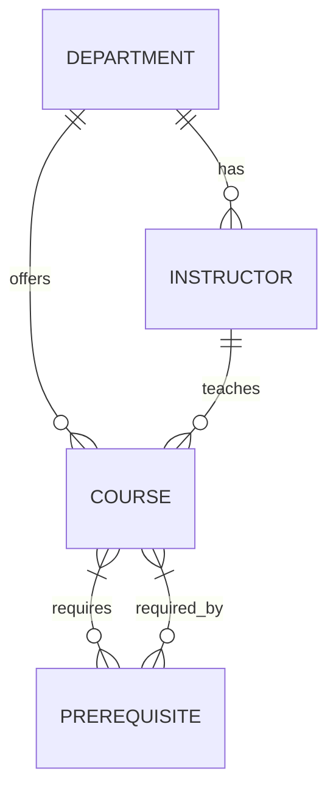

# Database Schema

## Entity Relationship Diagram



## Tables

### `departments`

| Column | Type | Constraints | Description |
|--------|------|-------------|-------------|
| `id` | INTEGER | PK, AUTOINCREMENT | Unique identifier |
| `name` | VARCHAR(255) | NOT NULL | Department full name |
| `code` | VARCHAR(50) | NOT NULL, UNIQUE, INDEX | Short code (e.g., "CS") |

**Indexes:**
- `ix_departments_code` — Unique index on `code`

### `instructors`

| Column | Type | Constraints | Description |
|--------|------|-------------|-------------|
| `id` | INTEGER | PK, AUTOINCREMENT | Unique identifier |
| `name` | VARCHAR(255) | NOT NULL | Instructor full name |
| `email` | VARCHAR(255) | NOT NULL | Email address |
| `office` | VARCHAR(255) | NULLABLE | Office location |
| `department_id` | INTEGER | FK → departments.id, NOT NULL, INDEX | Owning department |

**Indexes:**
- `ix_instructors_name` — Index on `name` for search
- Foreign key index on `department_id`

### `courses`

| Column | Type | Constraints | Description |
|--------|------|-------------|-------------|
| `id` | INTEGER | PK, AUTOINCREMENT | Unique identifier |
| `course_code` | VARCHAR(50) | NOT NULL, UNIQUE, INDEX | Course code (e.g., "CS101") |
| `title` | VARCHAR(255) | NOT NULL | Course title |
| `description` | TEXT | NOT NULL | Full course description |
| `credits` | INTEGER | NOT NULL | Credit hours |
| `instructor_id` | INTEGER | FK → instructors.id, NOT NULL, INDEX | Teaching instructor |
| `department_id` | INTEGER | FK → departments.id, NOT NULL, INDEX | Offering department |

**Indexes:**
- `ix_courses_course_code` — Unique index on `course_code`
- `ix_courses_title` — Index on `title` for search
- `ix_courses_department_id` — Foreign key index
- `ix_courses_instructor_id` — Foreign key index

### `prerequisites`

| Column | Type | Constraints | Description |
|--------|------|-------------|-------------|
| `course_id` | INTEGER | PK, FK → courses.id, INDEX | Dependent course |
| `prerequisite_id` | INTEGER | PK, FK → courses.id, INDEX | Prerequisite course |

**Constraints:**
- Composite Primary Key: `(course_id, prerequisite_id)`
- Foreign Key: `course_id` → `courses.id`
- Foreign Key: `prerequisite_id` → `courses.id`
- CHECK: `course_id != prerequisite_id` (no self-prerequisites)

**Indexes:**
- `ix_prerequisites_course_id` — Index on `course_id`
- `ix_prerequisites_prerequisite_id` — Index on `prerequisite_id`

## SQLAlchemy Models

### Department

```python
class Department(Base):
    __tablename__ = "departments"
    
    id = Column(Integer, primary_key=True, autoincrement=True)
    name = Column(String(255), nullable=False)
    code = Column(String(50), nullable=False, unique=True, index=True)
    
    instructors = relationship("Instructor", back_populates="department")
    courses = relationship("Course", back_populates="department")
```

### Instructor

```python
class Instructor(Base):
    __tablename__ = "instructors"
    
    id = Column(Integer, primary_key=True, autoincrement=True)
    name = Column(String(255), nullable=False)
    email = Column(String(255), nullable=False)
    office = Column(String(255), nullable=True)
    department_id = Column(Integer, ForeignKey("departments.id"), nullable=False)
    
    department = relationship("Department", back_populates="instructors")
    courses = relationship("Course", back_populates="instructor")
    
    __table_args__ = (Index("ix_instructors_name", "name"),)
```

### Course

```python
class Course(Base):
    __tablename__ = "courses"
    
    id = Column(Integer, primary_key=True, autoincrement=True)
    course_code = Column(String(50), nullable=False, unique=True)
    title = Column(String(255), nullable=False)
    description = Column(Text, nullable=False)
    credits = Column(Integer, nullable=False)
    instructor_id = Column(Integer, ForeignKey("instructors.id"), nullable=False)
    department_id = Column(Integer, ForeignKey("departments.id"), nullable=False)
    
    instructor = relationship("Instructor", back_populates="courses")
    department = relationship("Department", back_populates="courses")
    
    prerequisites = relationship(
        "Course",
        secondary="prerequisites",
        primaryjoin="Course.id==Prerequisite.course_id",
        secondaryjoin="Course.id==Prerequisite.prerequisite_id",
        back_populates="dependents",
    )
    dependents = relationship(
        "Course",
        secondary="prerequisites",
        primaryjoin="Course.id==Prerequisite.prerequisite_id",
        secondaryjoin="Course.id==Prerequisite.course_id",
        back_populates="prerequisites",
    )
    
    __table_args__ = (
        Index("ix_courses_course_code", "course_code"),
        Index("ix_courses_title", "title"),
        Index("ix_courses_department_id", "department_id"),
        Index("ix_courses_instructor_id", "instructor_id"),
    )
```

### Prerequisite

```python
class Prerequisite(Base):
    __tablename__ = "prerequisites"
    
    course_id = Column(Integer, ForeignKey("courses.id"), primary_key=True)
    prerequisite_id = Column(Integer, ForeignKey("courses.id"), primary_key=True)
    
    __table_args__ = (
        Index("ix_prerequisites_course_id", "course_id"),
        Index("ix_prerequisites_prerequisite_id", "prerequisite_id"),
    )
```

## Constraints Summary

| Constraint | Tables | Purpose |
|------------|--------|---------|
| Primary Key | All | Uniquely identify rows |
| Foreign Key | instructors, courses, prerequisites | Referential integrity |
| Unique | departments.code, courses.course_code | Prevent duplicates |
| Not Null | All required fields | Data completeness |
| Check | prerequisites | No self-prerequisites |

## Indexes Summary

| Index | Table | Columns | Purpose |
|-------|-------|---------|---------|
| `ix_departments_code` | departments | code | Unique lookup |
| `ix_instructors_name` | instructors | name | Search |
| `ix_courses_course_code` | courses | course_code | Unique lookup |
| `ix_courses_title` | courses | title | Search |
| `ix_courses_department_id` | courses | department_id | Join performance |
| `ix_courses_instructor_id` | courses | instructor_id | Join performance |
| `ix_prerequisites_course_id` | prerequisites | course_id | Graph traversal |
| `ix_prerequisites_prerequisite_id` | prerequisites | prerequisite_id | Graph traversal |

## Migration Notes

For schema changes (SQLite limitations):

```bash
# 1. Update models.py
# 2. Export data (if needed)
# 3. Drop database
rm data/catalog.db
# 4. Restart server (auto-migrates via create_all)
python -m uvicorn university_catalog.main:app
```

For production (PostgreSQL), use Alembic:

```bash
alembic revision --autogenerate -m "Add new column"
alembic upgrade head
```