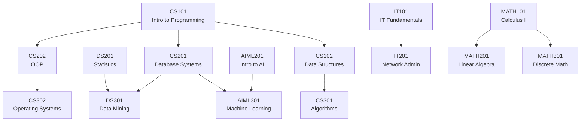

# Seeded Data Reference

## Overview

The database auto-seeds on first startup with realistic university data. Run seeding manually:

```python
from data.seed import seed_database
seed_database()
```

## Departments (5)

| ID | Code | Name |
|----|------|------|
| 1 | CS | Computer Science |
| 2 | AIML | Artificial Intelligence & Machine Learning |
| 3 | DS | Data Science |
| 4 | IT | Information Technology |
| 5 | MATH | Mathematics |

## Instructors (8)

| ID | Name | Email | Office | Department |
|----|------|-------|--------|------------|
| 1 | Dr. Alice Smith | alice.smith@university.edu | CS-101 | CS |
| 2 | Dr. Bob Johnson | bob.johnson@university.edu | CS-202 | CS |
| 3 | Dr. Carol Williams | carol.williams@university.edu | AIML-101 | AIML |
| 4 | Dr. David Brown | david.brown@university.edu | DS-101 | DS |
| 5 | Dr. Eva Martinez | eva.martinez@university.edu | IT-101 | IT |
| 6 | Dr. Frank Chen | frank.chen@university.edu | MATH-101 | MATH |
| 7 | Dr. Grace Lee | grace.lee@university.edu | AIML-202 | AIML |
| 8 | Dr. Henry Davis | henry.davis@university.edu | DS-202 | DS |

## Courses (15)

| Code | Title | Credits | Department | Instructor |
|------|-------|---------|------------|------------|
| CS101 | Introduction to Programming | 3 | CS | Dr. Alice Smith |
| CS102 | Data Structures | 3 | CS | Dr. Alice Smith |
| CS201 | Database Systems | 3 | CS | Dr. Bob Johnson |
| CS202 | Object-Oriented Programming | 3 | CS | Dr. Bob Johnson |
| CS301 | Algorithms | 4 | CS | Dr. Alice Smith |
| CS302 | Operating Systems | 4 | CS | Dr. Bob Johnson |
| AIML201 | Introduction to Artificial Intelligence | 3 | AIML | Dr. Carol Williams |
| AIML301 | Machine Learning | 4 | AIML | Dr. Grace Lee |
| DS201 | Statistics for Data Science | 3 | DS | Dr. David Brown |
| DS301 | Data Mining | 3 | DS | Dr. Henry Davis |
| IT101 | Information Technology Fundamentals | 3 | IT | Dr. Eva Martinez |
| IT201 | Network Administration | 3 | IT | Dr. Eva Martinez |
| MATH101 | Calculus I | 4 | MATH | Dr. Frank Chen |
| MATH201 | Linear Algebra | 3 | MATH | Dr. Frank Chen |
| MATH301 | Discrete Mathematics | 3 | MATH | Dr. Frank Chen |

## Prerequisites (12)

| Course | Prerequisite | Relationship |
|--------|--------------|--------------|
| CS102 | CS101 | CS101 → CS102 |
| CS201 | CS101 | CS101 → CS201 |
| CS202 | CS101 | CS101 → CS202 |
| CS301 | CS102 | CS102 → CS301 |
| CS302 | CS202 | CS202 → CS302 |
| AIML301 | AIML201 | AIML201 → AIML301 |
| AIML301 | CS201 | CS201 → AIML301 |
| DS301 | DS201 | DS201 → DS301 |
| DS301 | CS201 | CS201 → DS301 |
| IT201 | IT101 | IT101 → IT201 |
| MATH201 | MATH101 | MATH101 → MATH201 |
| MATH301 | MATH101 | MATH101 → MATH301 |

## Prerequisite Chains

### Computer Science Core
```
CS101 → CS102 → CS301
CS101 → CS201
CS101 → CS202 → CS302
```

### Cross-Department
```
CS201 → AIML301
CS201 → DS301
```

### Department-Specific
```
AIML201 → AIML301
DS201 → DS301
IT101 → IT201
MATH101 → MATH201
MATH101 → MATH301
```

## Visual Graph



## Course Descriptions

### CS101 — Introduction to Programming
**Credits**: 3 | **Department**: CS | **Instructor**: Dr. Alice Smith
> A foundational course covering programming fundamentals, variables, control structures, functions, and basic data types using Python.

### CS102 — Data Structures
**Credits**: 3 | **Department**: CS | **Instructor**: Dr. Alice Smith
> Study of fundamental data structures including arrays, linked lists, stacks, queues, trees, and graphs with emphasis on algorithmic efficiency.

### CS201 — Database Systems
**Credits**: 3 | **Department**: CS | **Instructor**: Dr. Bob Johnson
> Introduction to database design, relational models, SQL, normalization, transactions, and database management systems.

### CS202 — Object-Oriented Programming
**Credits**: 3 | **Department**: CS | **Instructor**: Dr. Bob Johnson
> Principles of object-oriented design including encapsulation, inheritance, polymorphism, and design patterns using Java.

### CS301 — Algorithms
**Credits**: 4 | **Department**: CS | **Instructor**: Dr. Alice Smith
> Advanced algorithm design and analysis including sorting, searching, graph algorithms, dynamic programming, and NP-completeness.

### CS302 — Operating Systems
**Credits**: 4 | **Department**: CS | **Instructor**: Dr. Bob Johnson
> Fundamentals of operating systems including processes, scheduling, memory management, file systems, and concurrency.

### AIML201 — Introduction to Artificial Intelligence
**Credits**: 3 | **Department**: AIML | **Instructor**: Dr. Carol Williams
> Overview of AI concepts including search algorithms, knowledge representation, reasoning, planning, and introduction to machine learning.

### AIML301 — Machine Learning
**Credits**: 4 | **Department**: AIML | **Instructor**: Dr. Grace Lee
> Comprehensive study of machine learning algorithms including supervised, unsupervised, and reinforcement learning with practical applications.

### DS201 — Statistics for Data Science
**Credits**: 3 | **Department**: DS | **Instructor**: Dr. David Brown
> Statistical foundations for data science including probability, distributions, hypothesis testing, regression, and Bayesian inference.

### DS301 — Data Mining
**Credits**: 3 | **Department**: DS | **Instructor**: Dr. Henry Davis
> Techniques for discovering patterns in large datasets including classification, clustering, association rules, and anomaly detection.

### IT101 — Information Technology Fundamentals
**Credits**: 3 | **Department**: IT | **Instructor**: Dr. Eva Martinez
> Introduction to IT concepts including hardware, software, networking, security, and system administration basics.

### IT201 — Network Administration
**Credits**: 3 | **Department**: IT | **Instructor**: Dr. Eva Martinez
> Design, implementation, and management of computer networks including routing, switching, wireless, and network security.

### MATH101 — Calculus I
**Credits**: 4 | **Department**: MATH | **Instructor**: Dr. Frank Chen
> Differential calculus including limits, derivatives, applications of differentiation, and introduction to integration.

### MATH201 — Linear Algebra
**Credits**: 3 | **Department**: MATH | **Instructor**: Dr. Frank Chen
> Vector spaces, linear transformations, eigenvalues, eigenvectors, and applications to computer science and data science.

### MATH301 — Discrete Mathematics
**Credits**: 3 | **Department**: MATH | **Instructor**: Dr. Frank Chen
> Logic, set theory, combinatorics, graph theory, and mathematical proofs with applications to computer science.

## Data Validation

### Row Counts
- Departments: 5
- Instructors: 8
- Courses: 15
- Prerequisites: 12

### Integrity Checks
- ✅ All foreign keys valid
- ✅ No self-prerequisites
- ✅ No cycles (DAG verified)
- ✅ Unique course codes
- ✅ Unique department codes
- ✅ All courses have instructor and department

## Customizing Seed Data

Edit `data/seed.py` to modify:

```python
departments_data = [
    {"name": "Computer Science", "code": "CS"},
    # Add more departments
]

instructors_data = [
    {"name": "Dr. New Professor", "email": "new@university.edu", "office": "CS-303", "department_code": "CS"},
    # Add more instructors
]

courses_data = [
    {"course_code": "CS401", "title": "Advanced Topics", "description": "...", "credits": 3, "instructor": "Dr. New Professor", "department_code": "CS"},
    # Add more courses
]

prerequisites_data = [
    ("CS401", "CS301"),
    # Add more prerequisites
]
```

Then reseed:
```bash
rm data/catalog.db
python -m uvicorn university_catalog.main:app
```