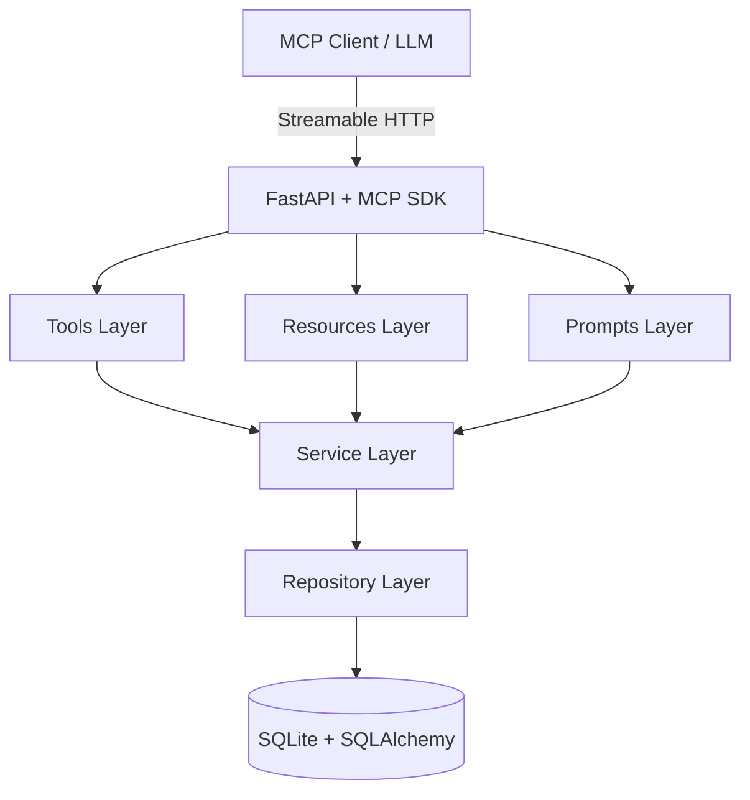

# University Course Catalog MCP Server

A production-grade **Model Context Protocol (MCP) server** that exposes a university course catalog through standardized tools, resources, and prompts.

## Overview

The Model Context Protocol (MCP) is an open standard that enables AI applications to securely connect to external data sources and tools. This server implements MCP to provide structured access to a university course catalog, allowing AI assistants to:

- **Search courses** by keyword across codes, titles, and descriptions
- **Retrieve prerequisites** (direct and transitive)
- **Look up instructors** with contact information
- **Visualize dependency graphs** for course planning
- **Access catalog data** as structured resources
- **Use prompt templates** for course comparison and advising

## Quick Links

| Resource | Link |
|----------|------|
| 📖 **Documentation** | [Read the Docs](https://yourusername.github.io/university-course-catalog-mcp) |
| 🐳 **Docker Hub** | [Docker Image](https://hub.docker.com/r/yourusername/university-catalog-mcp) |
| 📦 **PyPI** | [Package](https://pypi.org/project/university-catalog/) |
| 🐛 **Issues** | [GitHub Issues](https://github.com/yourusername/university-course-catalog-mcp/issues) |
| 💬 **Discussions** | [GitHub Discussions](https://github.com/yourusername/university-course-catalog-mcp/discussions) |

## Features at a Glance

=== "Tools (4)"
    - `search_courses` — Full-text search with department filter
    - `get_prerequisites` — Direct prerequisite retrieval
    - `lookup_instructor` — Case-insensitive instructor search
    - `get_prerequisite_graph` — Complete transitive dependency graph

=== "Resources (2)"
    - `resource://course_descriptions` — All courses with full details
    - `resource://department_directory` — All departments with codes

=== "Prompts (2)"
    - `course_comparison_template` — Structured course comparison
    - `course_advisor` — Academic advising assistant

=== "API"
    - `GET /health` — Health check endpoint
    - `GET /` — Server information
    - `GET /mcp` — MCP Streamable HTTP endpoint

## Architecture



## Quick Start

### Docker (Recommended)

```bash
docker compose up --build -d
curl http://localhost:8080/health
```

### Local Development

```bash
git clone https://github.com/yourusername/university-course-catalog-mcp.git
cd university-course-catalog-mcp
python -m venv .venv
source .venv/bin/activate
pip install -r requirements.txt
python -m uvicorn university_catalog.main:app --reload
```

## Requirements

- Python 3.12+
- Docker (optional)

## License

MIT License — see [LICENSE](LICENSE) for details.