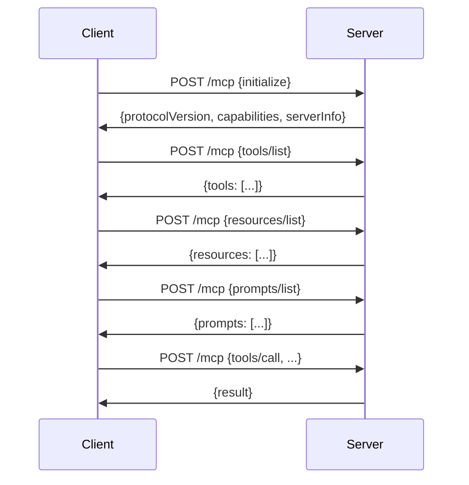

# MCP Transport

## Streamable HTTP

This server implements MCP over **Streamable HTTP** transport (MCP specification 2024-11-05).

### Endpoint

```
GET /mcp
POST /mcp
```

### Protocol Flow



### Initialization

```json
// Client → Server
{
  "jsonrpc": "2.0",
  "id": 1,
  "method": "initialize",
  "params": {
    "protocolVersion": "2024-11-05",
    "capabilities": {},
    "clientInfo": {
      "name": "my-client",
      "version": "1.0.0"
    }
  }
}

// Server → Client
{
  "jsonrpc": "2.0",
  "id": 1,
  "result": {
    "protocolVersion": "2024-11-05",
    "capabilities": {
      "tools": {},
      "resources": {},
      "prompts": {}
    },
    "serverInfo": {
      "name": "University Course Catalog",
      "version": "1.0.0"
    }
  }
}
```

### Method Reference

| Method | Direction | Description |
|--------|-----------|-------------|
| `initialize` | C→S | Protocol handshake |
| `tools/list` | C→S | List available tools |
| `tools/call` | C→S | Invoke a tool |
| `resources/list` | C→S | List available resources |
| `resources/read` | C→S | Read a resource |
| `prompts/list` | C→S | List available prompts |
| `prompts/get` | C→S | Get a prompt template |
| `notifications/initialized` | C→S | Client ready |

### Tool Invocation

```json
// Request
{
  "jsonrpc": "2.0",
  "id": 2,
  "method": "tools/call",
  "params": {
    "name": "search_courses",
    "arguments": {
      "query": "programming",
      "department_code": "CS"
    }
  }
}

// Response (success)
{
  "jsonrpc": "2.0",
  "id": 2,
  "result": {
    "content": [
      {
        "type": "text",
        "text": "[{\"course_code\":\"CS101\",\"title\":\"Introduction to Programming\",\"credits\":3},...]"
      }
    ]
  }
}

// Response (error)
{
  "jsonrpc": "2.0",
  "id": 2,
  "result": {
    "content": [
      {
        "type": "text",
        "text": "{\"error\":\"Course not found\"}"
      }
    ],
    "isError": true
  }
}
```

### Resource Reading

```json
// Request
{
  "jsonrpc": "2.0",
  "id": 3,
  "method": "resources/read",
  "params": {
    "uri": "resource://course_descriptions"
  }
}

// Response
{
  "jsonrpc": "2.0",
  "id": 3,
  "result": {
    "contents": [
      {
        "uri": "resource://course_descriptions",
        "mimeType": "text/plain",
        "text": "[CS101] Introduction to Programming: ..."
      }
    ]
  }
}
```

### Prompt Fetching

```json
// Request
{
  "jsonrpc": "2.0",
  "id": 4,
  "method": "prompts/get",
  "params": {
    "name": "course_comparison_template",
    "arguments": {
      "course_code_1": "CS101",
      "course_code_2": "CS102"
    }
  }
}

// Response
{
  "jsonrpc": "2.0",
  "id": 4,
  "result": {
    "description": "Template for comparing two courses...",
    "messages": [
      {
        "role": "user",
        "content": {
          "type": "text",
          "text": "Compare the following two courses...\n\nCourse 1: {{course_code_1}}\nCourse 2: {{course_code_2}}\n..."
        }
      }
    ]
  }
}
```

## Server Implementation

### FastMCP Integration

```python
# src/university_catalog/mcp/server.py
from mcp.server.fastmcp import FastMCP

def create_mcp_server() -> FastMCP:
    mcp = FastMCP("University Course Catalog")
    register_tools(mcp)
    register_resources(mcp)
    register_prompts(mcp)
    return mcp

mcp_server = create_mcp_server()
```

### FastAPI Mounting

```python
# src/university_catalog/main.py
from starlette.routing import Mount

app = FastAPI(
    routes=[
        Mount("/mcp", app=mcp_server.sse_app()),
    ],
)
```

The `sse_app()` method returns a Starlette application handling MCP protocol.

## Client Connection

### Connection URL

```
http://localhost:8080/mcp
```

### Using Official SDKs

=== "Python"
    ```python
    from mcp.client.streamable_http import streamablehttp_client
    from mcp import ClientSession
    
    async with streamablehttp_client("http://localhost:8080/mcp") as (read, write):
        async with ClientSession(read, write) as session:
            await session.initialize()
            tools = await session.list_tools()
            result = await session.call_tool("search_courses", {"query": "data"})
    ```

=== "TypeScript"
    ```typescript
    import { Client } from "@modelcontextprotocol/sdk/client/index.js";
    import { StreamableHTTPClientTransport } from "@modelcontextprotocol/sdk/client/streamableHttp.js";
    
    const transport = new StreamableHTTPClientTransport(
      new URL("http://localhost:8080/mcp")
    );
    const client = new Client({ name: "my-app", version: "1.0.0" });
    await client.connect(transport);
    const tools = await client.listTools();
    ```

=== "Raw HTTP (cURL)"
    ```bash
    # Initialize
    curl -X POST http://localhost:8080/mcp \
      -H "Content-Type: application/json" \
      -d '{"jsonrpc":"2.0","id":1,"method":"initialize","params":{"protocolVersion":"2024-11-05","capabilities":{},"clientInfo":{"name":"test","version":"1.0"}}}'
    
    # List tools
    curl -X POST http://localhost:8080/mcp \
      -H "Content-Type: application/json" \
      -d '{"jsonrpc":"2.0","id":2,"method":"tools/list"}'
    ```

## Transport Details

### Headers

| Header | Value |
|--------|-------|
| `Content-Type` | `application/json` |
| `Accept` | `application/json` |

### Streaming

Supports Server-Sent Events (SSE) for real-time updates:

```
GET /mcp
Accept: text/event-stream
```

### CORS

Configure for browser clients:

```python
# main.py
from fastapi.middleware.cors import CORSMiddleware

app.add_middleware(
    CORSMiddleware,
    allow_origins=["https://your-app.com"],
    allow_credentials=True,
    allow_methods=["POST", "GET", "OPTIONS"],
    allow_headers=["Content-Type", "Accept"],
)
```

## Health Check

The MCP endpoint responds to health checks:

```bash
# Via MCP protocol
curl -X POST http://localhost:8080/mcp \
  -H "Content-Type: application/json" \
  -d '{"jsonrpc":"2.0","id":1,"method":"initialize","params":{"protocolVersion":"2024-11-05","capabilities":{},"clientInfo":{"name":"health","version":"1.0"}}}'

# Via HTTP (separate endpoint)
curl http://localhost:8080/health
```

## Debugging

### MCP Inspector

```bash
npx @modelcontextprotocol/inspector http://localhost:8080/mcp
```

### Enable Debug Logging

```bash
LOG_LEVEL=DEBUG python -m uvicorn university_catalog.main:app
```

### Log Output

```
INFO: MCP Server: Initialized connection from 127.0.0.1
INFO: MCP Tool: search_courses called with {"query": "programming"}
INFO: MCP Tool: search_courses returned 3 results
```

## Troubleshooting

| Issue | Solution |
|-------|----------|
| `404 Not Found` | Ensure using `/mcp` not `/mcp/` |
| `405 Method Not Allowed` | Use POST for JSON-RPC, GET for SSE |
| `Connection Refused` | Server not running or wrong port |
| `Protocol Version Mismatch` | Use `2024-11-05` |
| `Tool Not Found` | Check `tools/list` first |
| `Resource Not Found` | Check `resources/list` first |

## Specifications

- [MCP Specification](https://spec.modelcontextprotocol.io/)
- [Streamable HTTP Transport](https://spec.modelcontextprotocol.io/transports/streamable-http/)
- [JSON-RPC 2.0](https://www.jsonrpc.org/specification)